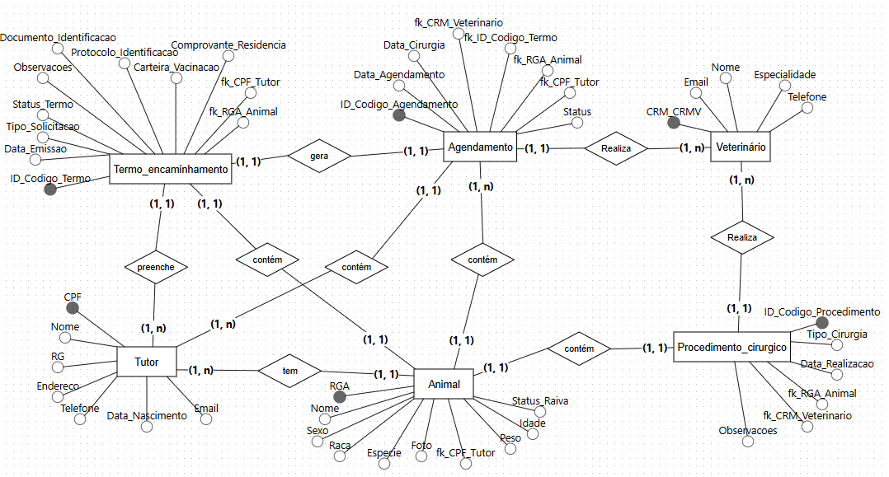
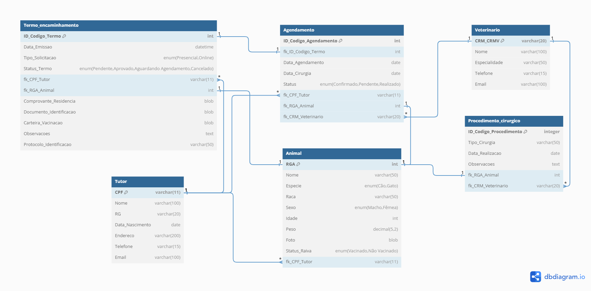

# SCPC_PETS

Mini-projeto do M3 de Banco de Dados do curso de FullStack do PdA; 


# Sistema de Cadastro para a Castração de Pets
Usei como inspiração o projeto em início, de castramento de animais que está sendo realizado pela prefeitura da minha cidade com parceria com ONGs de proteção animal e veterinários da região.

## Objetivos do Projeto

- **Resolver Problemas Relacionados ao Bem-Estar Animal:** Focar na melhoria das condições de vida de cães e gatos em situação de rua.
- **Desenvolver um Diagrama Conceitual do Sistema:** Criar uma representação visual das interações entre tutores de animais e serviços de castração.
- **Criar um Diagrama Entidade-Relacionamento (ER):** Estruturar as informações necessárias para o funcionamento do sistema, identificando entidades como animais, tutores, veterinários e outros.
- **Implementar um Programa de Castração:** Colaborar com ONGs e veterinários locais para oferecer serviços de castração gratuitos ou a preços reduzidos.
- **Educar a Comunidade:** Promover campanhas de conscientização sobre a importância da castração e do cuidado responsável com os animais de estimação.

## Problematização

A situação dos animais em situação de rua é alarmante e exige uma abordagem multifacetada. Muitas vezes, esses animais são vítimas de envenenamento e outras formas de crueldade. A falta de recursos para castração entre os tutores e as ONGs contribui para o aumento da população animal desamparada. Portanto, um dos principais objetivos é desenvolver um sistema que facilite o acesso à castração para animais em situação de rua, aqueles sob a tutela de ONGs e os que já possuem lares, mas cujos tutores não têm condições financeiras para arcar com o procedimento.

## Solução

Um programa de castração abrangente atenderá animais abandonados, aqueles sob a tutela de ONGs e os que já têm lares, mas cujos tutores não podem arcar com os custos. Ao oferecer serviços gratuitos ou a preços reduzidos, garantimos a esterilização de um número significativo de animais, reduzindo o sofrimento e controlando a população. 

A castração é uma medida essencial que promove o bem-estar animal. Além de prevenir ninhadas indesejadas, a cirurgia traz benefícios à saúde, como a redução do risco de doenças reprodutivas e comportamentais. Animais castrados geralmente têm uma vida mais longa e saudável, resultando em menos gastos com cuidados veterinários.

Para o sucesso do programa, é crucial promover campanhas educativas sobre a importância da castração e do cuidado responsável. Essas iniciativas informarão os tutores sobre os benefícios da castração e incentivarão a adoção responsável. Com a colaboração entre ONGs, veterinários e a comunidade, podemos criar um ambiente mais seguro para os animais e reduzir significativamente o abandono.

## Requisitos Especificados

- Validação de idade do tutor (maior de 18 anos);
- Comprovação de residência;
- Verificação da idade do animal (3 meses a 10 anos);
- Confirmação de vacinação contra raiva.

## Relacionamentos

- **Tutor** emite **TermoEncaminhamento**;
- **Animal** está vinculado ao **TermoEncaminhamento**;
- **TermoEncaminhamento** gera **Agendamento**.

### Regras de Negócio

- Validação automática de idade do tutor;
- Verificação de documentação completa;
- Geração de protocolo único para cada termo;
- Limite de um termo por animal.

## Explicação dos Relacionamentos

1. **Tutor**
   - Pode ter múltiplos Animais;
   - Emite Termos de Encaminhamento.

2. **Animal**
   - Pertence a um Tutor;
   - Pode ter Termo de Encaminhamento;
   - Pode realizar Procedimento Cirúrgico.

3. **Termo de Encaminhamento**
   - Gerado por um Tutor;
   - Vinculado a um Animal;
   - Pode gerar um Agendamento.

4. **Veterinário**
   - Realiza Agendamentos;
   - Executa Procedimentos Cirúrgicos.

5. **Agendamento**
   - Criado a partir de um Termo;
   - Realizado por um Veterinário.

6. **Procedimento Cirúrgico**
   - Executado por um Veterinário;
   - Realizado em um Animal.

## Modelos

### Diagrama Conceitual
É uma representação abstrata que descreve os elementos e as interações de um sistema, focando nas necessidades do usuário e nas regras de negócio.


### Diagrama Entidade-Relacionamento
É uma representação gráfica que ilustra as entidades de um sistema e suas relações, facilitando o design e a organização de bancos de dados.



## Estrutura do Banco de Dados
## Tabela MySQL
Abaixo está a estrutura do banco de dados para o projeto SCPC_PETS:

```sql
CREATE database mp_scpc_pets;

CREATE TABLE Tutor (
    CPF VARCHAR(11) PRIMARY KEY NOT NULL,
    Nome VARCHAR(100) NOT NULL,
    RG VARCHAR(20) NOT NULL,
    Data_Nascimento DATE NOT NULL,
    Endereco VARCHAR(200) NOT NULL,
    Telefone VARCHAR(15),
    Email VARCHAR(100)
);

CREATE TABLE Animal (
    RGA INT PRIMARY KEY NOT NULL,
    Nome VARCHAR(50),
    Especie ENUM('Cão', 'Gato') NOT NULL,
    Raca VARCHAR(50),
    Sexo ENUM('Macho', 'Fêmea') NOT NULL,
    Idade INT NOT NULL,
    Peso DECIMAL(5,2),
    Foto BLOB,
    Status_Raiva ENUM('Vacinado', 'Não Vacinado'),
    fk_CPF_Tutor VARCHAR(11),
    FOREIGN KEY (fk_CPF_Tutor) REFERENCES Tutor(CPF)
);

CREATE TABLE Termo_Encaminhamento (
    ID_Codigo_Termo INT PRIMARY KEY NOT NULL auto_increment,
    Data_Emissao DATETIME NOT NULL,
    Tipo_Solicitacao ENUM('Presencial', 'Online') NOT NULL,
    Status_Termo ENUM('Pendente', 'Aprovado', 'Aguardando Agendamento', 'Cancelado') NOT NULL,
    fk_CPF_Tutor VARCHAR(11),
    fk_RGA_Animal INT,
    Comprovante_Residencia BLOB,
    Documento_Identificacao BLOB,
    Carteira_Vacinacao BLOB,
    Observacoes TEXT,
    Protocolo_Identificacao VARCHAR(50),
    FOREIGN KEY (fk_CPF_Tutor) REFERENCES Tutor(CPF),
    FOREIGN KEY (fk_RGA_Animal) REFERENCES Animal(RGA)
);

CREATE TABLE Veterinario (
    CRM_CRMV VARCHAR(20) PRIMARY KEY NOT NULL,
    Nome VARCHAR(100) NOT NULL,
    Especialidade VARCHAR(50),
    Telefone VARCHAR(15),
    Email VARCHAR(100)
);

CREATE TABLE Agendamento (
    ID_Codigo_Agendamento INT PRIMARY KEY NOT NULL auto_increment,
    fk_ID_Codigo_Termo INT,
    Data_Agendamento DATE NOT NULL,
    Data_Cirurgia DATE NOT NULL,
    Status ENUM('Confirmado', 'Pendente', 'Realizado') NOT NULL,
    fk_CPF_Tutor VARCHAR(11),
    fk_RGA_Animal INT,
    fk_CRM_Veterinario VARCHAR(20),
    FOREIGN KEY (fk_ID_Codigo_Termo) REFERENCES Termo_Encaminhamento(ID_Codigo_Termo),
    FOREIGN KEY (fk_CPF_Tutor) REFERENCES Tutor(CPF),
    FOREIGN KEY (fk_RGA_Animal) REFERENCES Animal(RGA),
    FOREIGN KEY (fk_CRM_Veterinario) REFERENCES Veterinario(CRM_CRMV)
);

CREATE TABLE Procedimento_Cirurgico (
    ID_Codigo_Procedimento INT PRIMARY KEY NOT NULL auto_increment,
    Tipo_Cirurgia VARCHAR(50) NOT NULL,
    Data_Realizacao DATE NOT NULL,
    Observacoes TEXT,
    fk_RGA_Animal INT,
    fk_CRM_Veterinario VARCHAR(20),
    FOREIGN KEY (fk_RGA_Animal) REFERENCES Animal(RGA),
    FOREIGN KEY (fk_CRM_Veterinario) REFERENCES Veterinario(CRM_CRMV)
);
```
### [Link para os Slides](https://www.canva.com/design/DAGdsDO92eM/8Xvsph-AV1iIEalF--UAIA/edit?utm_content=DAGdsDO92eM&utm_campaign=designshare&utm_medium=link2&utm_source=sharebutton)
### [Linkedin](https://www.linkedin.com/in/daianebarbosak/)
